# CookieMovie

1st PJT

## 참고

CookieMovie.pdf를 참고해주세요.

## 기술 스택

## DB Part

- ERD 1 : 모델 테이블, 관계 테이블, 관계 설명
  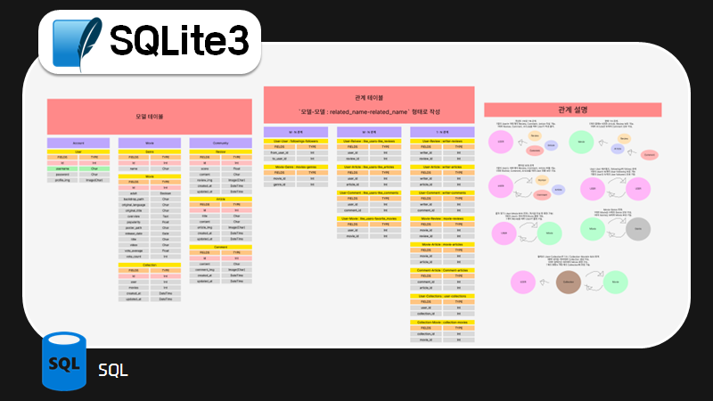
- ERD 2 : 모델 테이블, 전체 관계 그래프
  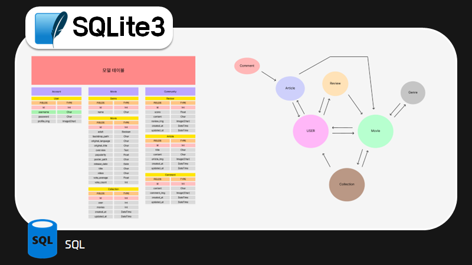

## Front-End Part

- vue 기획1 : ppt 및 Figma
  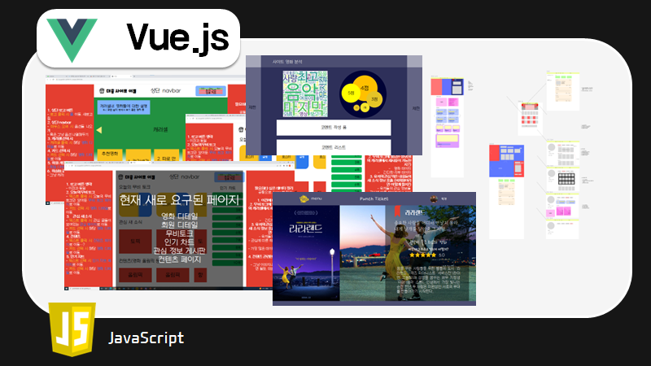
- vue 기획2 : 컴포넌트 및 vuex 설계
  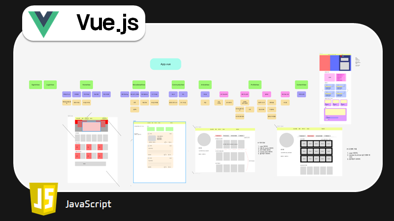
- vue 화면1 : 홈
  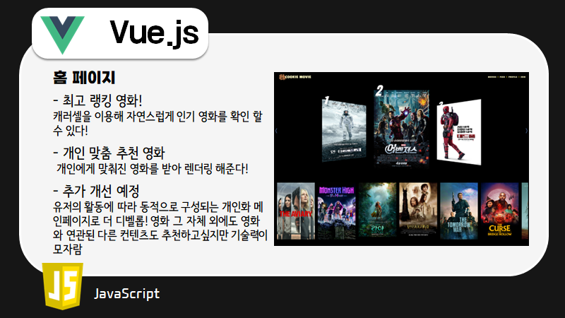
- vue 화면2 : 로그인/회원가입
  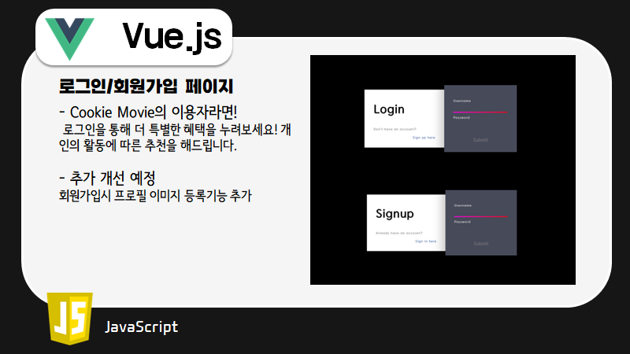
- vue 화면3 : 영화 상세
  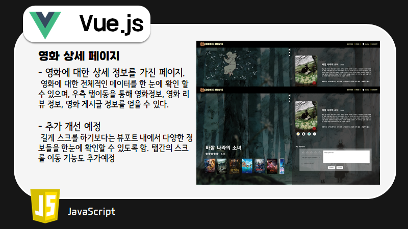
- vue 화면4 : 영화 목록
  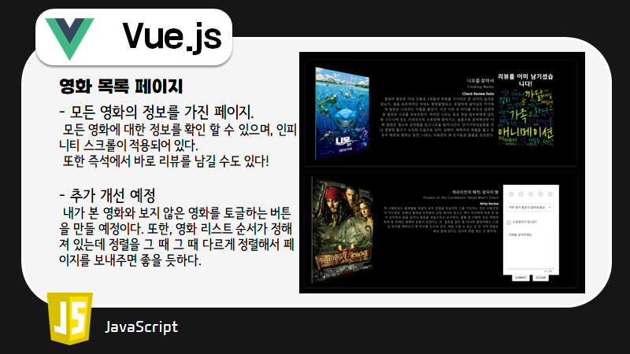
- vue 화면5 : 피드
  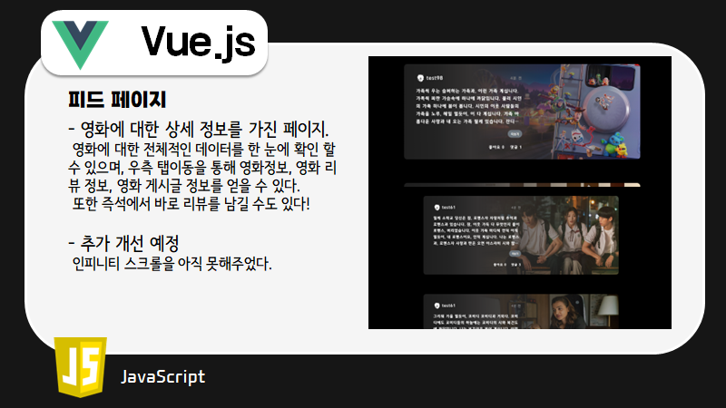
- vue 화면6 : 컬렉션
  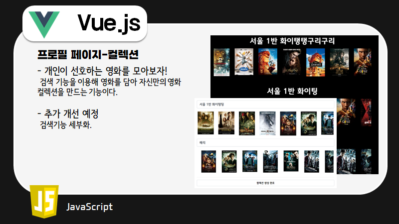
- vue 화면7 : 게시글 상세
  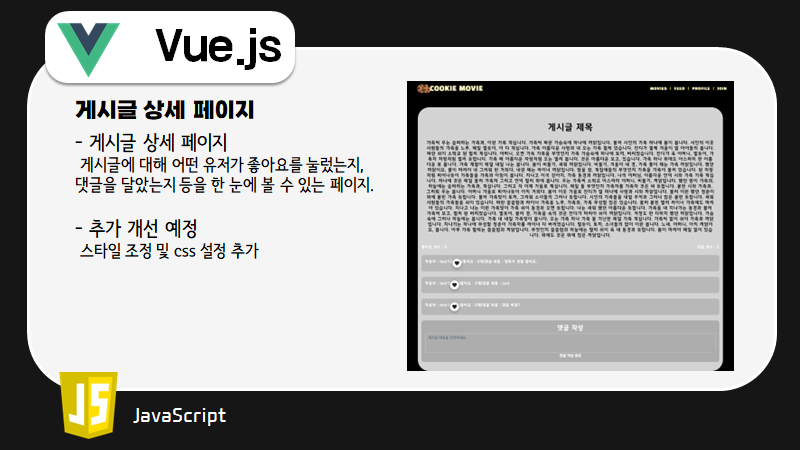

## Back-End Part

- 기능1 : 컬렉션 기능
  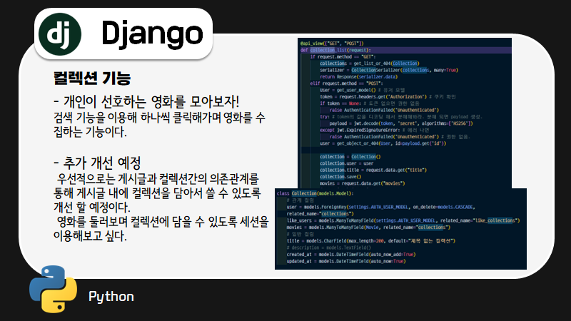
- 기능2 : 커뮤니티 기능
  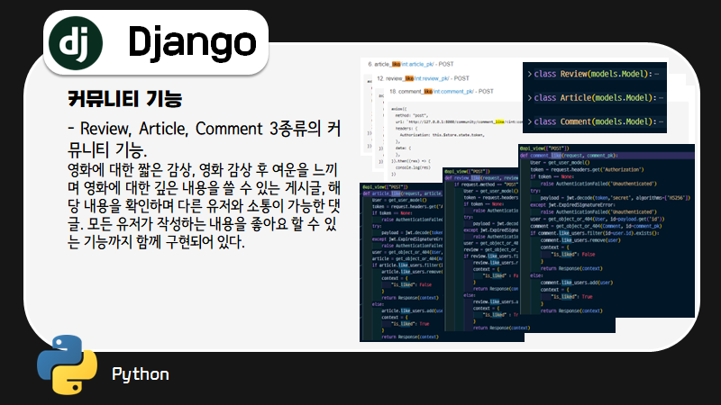
- 기능3 : 게시글 분석
  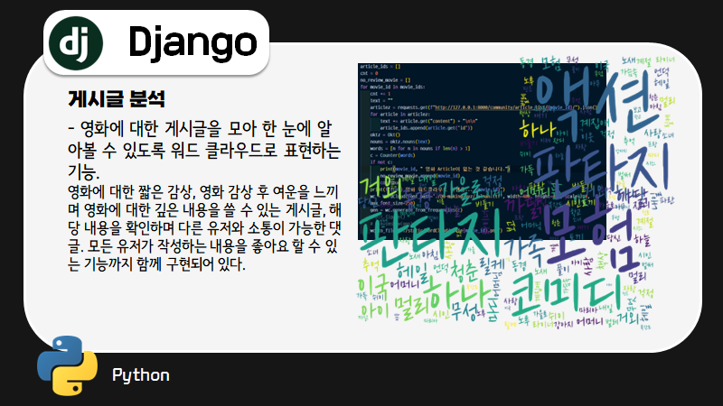
- 기능4 : 영화 랭킹 알고리즘
  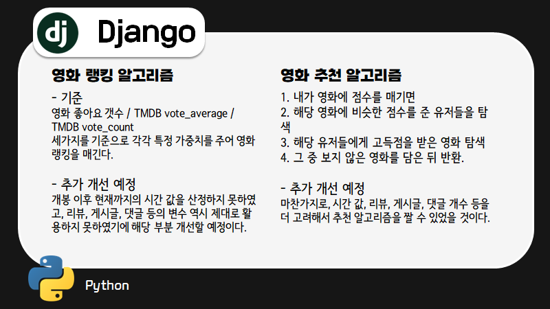
